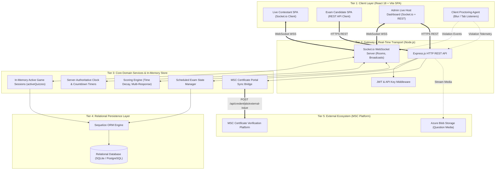
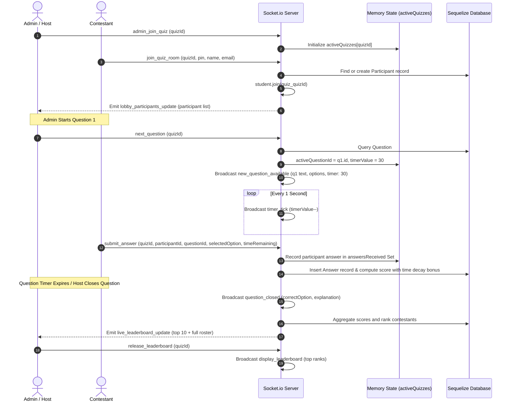
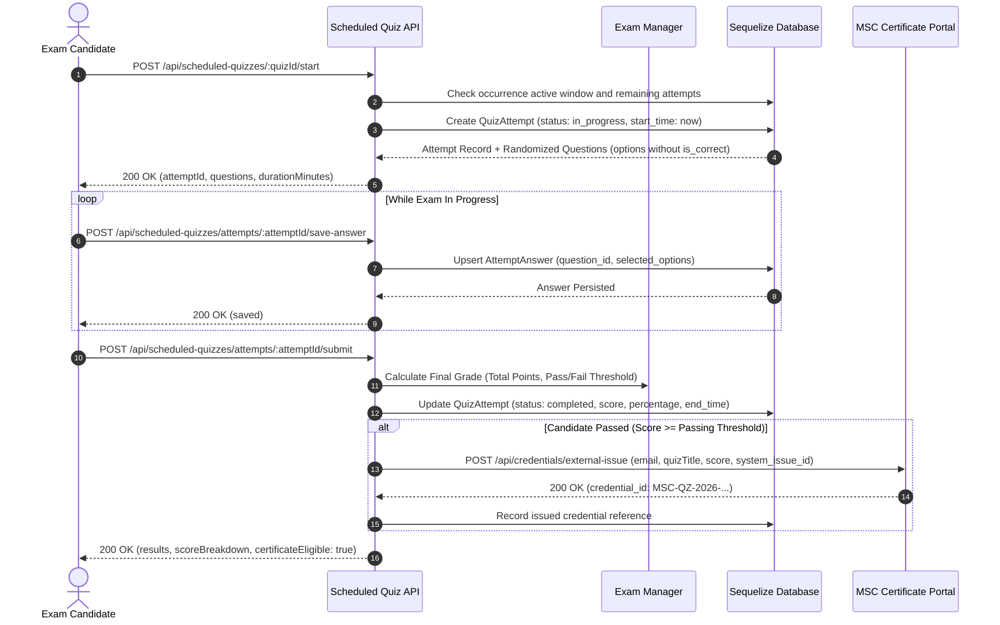
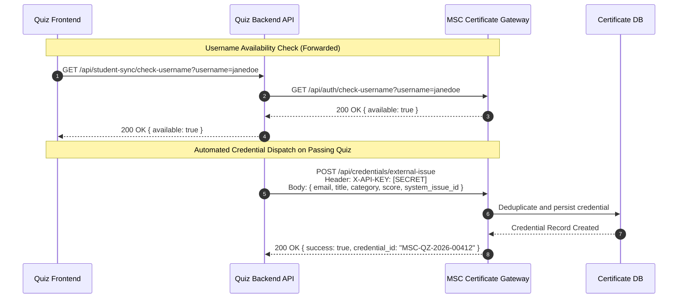
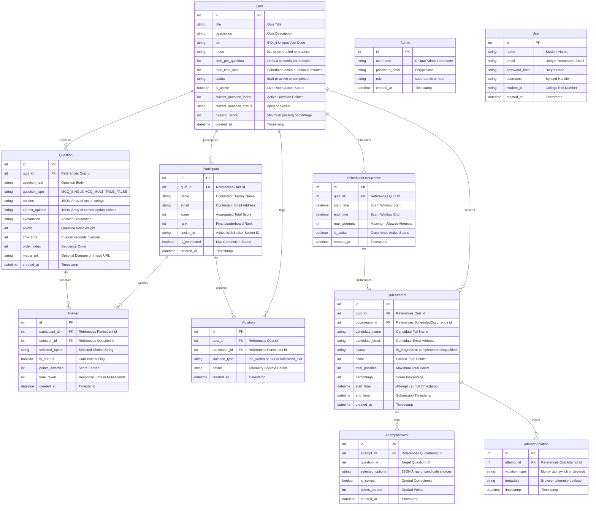
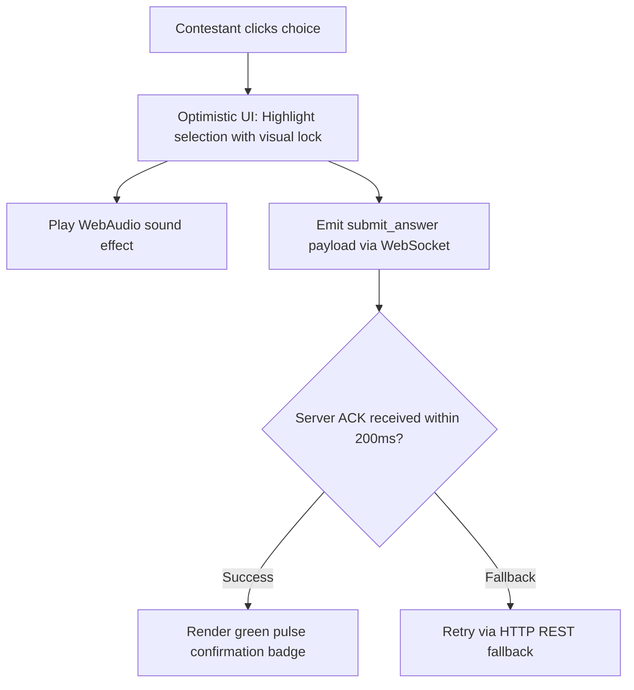

# System Architecture & Technical Design Document (Detailed Specification)

**Project Name**: Microsoft Student Club (MSC PRPCEM) — Real-Time Live & Scheduled Quiz Assessment Platform  
**System Version**: 2.0.0  
**Document Classification**: Engineering Architecture & Technical Design Specification  
**Primary Maintainer**: Microsoft Student Club Technical Architecture Team  
**Target Environments**: Node.js 18+ LTS, React 18+ (Vite), Sequelize ORM 6+, Socket.io 4+, SQLite 3 (Dev/Staging) & PostgreSQL 15+ (Production)

---

## Table of Contents
1. [Executive Summary & Core Architectural Tenets](#1-executive-summary--core-architectural-tenets)
2. [System Context & Domain Model](#2-system-context--domain-model)
3. [Codebase & Module Topology](#3-codebase--module-topology)
4. [High-Level Architecture & Multi-Tier Topology](#4-high-level-architecture--multi-tier-topology)
5. [Core Subsystems & Technical Workflow Specifications](#5-core-subsystems--technical-workflow-specifications)
   - 5.1 [Real-Time Socket.io Live Quiz Engine](#51-real-time-socketio-live-quiz-engine)
   - 5.2 [Scheduled Self-Paced Exam & Assessment Engine](#52-scheduled-self-paced-exam--assessment-engine)
   - 5.3 [Anti-Cheating, Proctoring & Violation Detection Subsystem](#53-anti-cheating-proctoring--violation-detection-subsystem)
   - 5.4 [Inter-Platform Identity & Credential Bridge (Certificate Portal Sync)](#54-inter-platform-identity--credential-bridge-certificate-portal-sync)
   - 5.5 [Question Bank & Scoring Analytics Subsystem](#55-question-bank--scoring-analytics-subsystem)
6. [Exhaustive Database Architecture & Data Dictionary](#6-exhaustive-database-architecture--data-dictionary)
   - 6.1 [Entity-Relationship Diagram (ERD)](#61-entity-relationship-diagram-erd)
   - 6.2 [Data Dictionary & Model Specifications](#62-data-dictionary--model-specifications)
7. [Comprehensive REST API & WebSocket Event Specification](#7-comprehensive-rest-api--websocket-event-specification)
   - 7.1 [RESTful API Endpoints](#71-restful-api-endpoints)
   - 7.2 [Socket.io Event Contracts (Client & Server)](#72-socketio-event-contracts-client--server)
8. [Client-Side UX & Performance Engineering](#8-client-side-ux--performance-engineering)
9. [Security Architecture & Threat Modeling](#9-security-architecture--threat-modeling)
10. [Reliability, Resilience & State Recovery](#10-reliability-resilience--state-recovery)
11. [Deployment, Infrastructure & Configuration Blueprint](#11-deployment-infrastructure--configuration-blueprint)

---

## 1. Executive Summary & Core Architectural Tenets

The **MSC PRPCEM Quiz & Assessment Platform** is a dual-mode interactive testing engine engineered to support both **high-concurrency live multiplayer quiz competitions** and **formal scheduled proctored certifications**. It bridges academic assessment with verifiable credentialing, automatically provisioning verified badges and certificates via the MSC Verification Gateway upon exam completion.

```
┌─────────────────────────────────────────────────────────────────────────────┐
│                          CORE ARCHITECTURAL TENETS                          │
├──────────────────┬──────────────────┬──────────────────┬────────────────────┤
│ 1. Sub-50ms Sync │ 2. Zero-Loss     │ 3. Automated     │ 4. Deterministic   │
│    Live State    │    Proctoring    │    Credentialing │    Scoring Engine  │
│ WebSocket rooms  │ Client blur, tab │ Passing scores   │ Speed + accuracy   │
│ broadcast timers │ switches, and    │ trigger instant  │ formula calculates │
│ and answers with │ fullscreen loss  │ verifiable badge │ leaderboard rank   │
│ sub-50ms latency │ logged in real-t │ webhook issuance │ in real time       │
└──────────────────┴──────────────────┴──────────────────┴────────────────────┘
```

---

## 2. System Context & Domain Model

### 2.1. System Actors
1. **Contestant / Student**: Joins live quiz rooms via 6-digit PINs, participates in scheduled certification exams, tracks leaderboard rankings.
2. **Quiz Master / Admin**: Authors questions, controls live quiz question advancement, monitors real-time violations, schedules exam time windows.
3. **Automated Proctor Agent**: Client-side monitoring hooks capturing tab switches, clipboard events, and window blur events.
4. **MSC Certificate Gateway**: Remote recipient of automated webhook dispatches for issuing verifiable credentials.

### 2.2. Dual Operating Modes
- **Mode A: Real-Time Live Quiz (Host-Driven)**:
  - Participants join a synchronized lobby via PIN code.
  - Admin controls question transitions (`question_open`, `timer_tick`, `question_close`, `show_leaderboard`).
  - Scoring incorporates time-decay bonuses ($Score = BasePoints \times \frac{TimeRemaining}{TotalTime}$).
- **Mode B: Scheduled Self-Paced Exam (Candidate-Driven)**:
  - Candidate takes an individual attempt within an active time window (`valid_from` to `valid_until`).
  - Independent countdown timer, randomized question order, answer persistence on every selection.
  - Automatic submission upon timer expiry with proctoring violation summary.

---

## 3. Codebase & Module Topology

```
c:\Quiz-platform\
├── backend/
│   ├── src/
│   │   ├── config/
│   │   │   └── database.js            # Sequelize database connection & dialect config
│   │   ├── middleware/
│   │   │   ├── auth.js                # JWT verification & session guards
│   │   │   └── requireAdmin.js        # Admin role authorization guard
│   │   ├── models/
│   │   │   ├── Admin.js               # Admin credentials & superuser flags
│   │   │   ├── Answer.js              # Live quiz participant answer submissions
│   │   │   ├── AttemptAnswer.js       # Scheduled quiz candidate answer selections
│   │   │   ├── AttemptViolation.js    # Scheduled quiz proctoring violation logs
│   │   │   ├── Participant.js         # Live quiz participant records & scores
│   │   │   ├── Question.js            # Question bank (MCQ, Multi-select, Code, Media)
│   │   │   ├── Quiz.js                # Quiz parent metadata, mode, PIN, timer settings
│   │   │   ├── QuizAttempt.js         # Scheduled quiz attempt instance & final score
│   │   │   ├── ScheduledOccurrence.js # Time-window occurrence schedule
│   │   │   ├── User.js                # Synchronized student accounts & credentials
│   │   │   ├── Violation.js           # Live quiz proctoring violation events
│   │   │   └── index.js               # Model relationships & foreign key mappings
│   │   ├── routes/
│   │   │   ├── analytics.js           # Quiz metrics, question difficulty, export
│   │   │   ├── auth.js                # Admin & Student authentication
│   │   │   ├── branding.js            # Custom themes, club logos, color tokens
│   │   │   ├── export.js              # CSV and Excel export generators
│   │   │   ├── quiz.js                # Quiz CRUD, PIN generator, live session controls
│   │   │   ├── scheduledQuiz.js       # Scheduled attempt start, submit, answer persist
│   │   │   └── studentSync.js         # Bridge to MSC Certificate Portal API
│   │   ├── services/
│   │   │   └── socket.js              # Socket.io real-time live game & timer engine
│   │   └── server.js                  # Express app, HTTP server, and Socket.io init
│   └── package.json
│
├── frontend/
│   ├── src/
│   │   ├── components/
│   │   │   ├── Navbar.jsx             # Global navigation & student wallet badge
│   │   │   ├── Footer.jsx             # Legal links & MSC branding footer
│   │   │   ├── ProtectedRoute.jsx     # Auth gate for admin and student routes
│   │   │   └── Timer.jsx              # High-precision SVG circular countdown timer
│   │   ├── context/
│   │   │   ├── AuthContext.jsx        # Student & Admin JWT session state
│   │   │   └── SocketContext.jsx      # Centralized Socket.io client instance
│   │   ├── pages/
│   │   │   ├── AdminDashboard.jsx     # Master admin control center
│   │   │   ├── AdminScheduledQuizzes.jsx # Scheduled exams manager
│   │   │   ├── CreateScheduledQuiz.jsx# Wizard for scheduling exam time windows
│   │   │   ├── Home.jsx               # Landing page with active PIN entry
│   │   │   ├── JoinQuiz.jsx           # Live lobby waiting room for participants
│   │   │   ├── LiveQuiz.jsx           # Real-time contestant gameplay screen
│   │   │   ├── PracticeQuiz.jsx       # Solo practice mode with instant feedback
│   │   │   ├── QuestionManagement.jsx # Question builder (Options, Points, Media)
│   │   │   ├── QuizManagement.jsx     # Quiz editor & settings configuration
│   │   │   ├── Results.jsx            # Live podium, ranks, and breakdown
│   │   │   ├── RunQuiz.jsx            # Admin live host control dashboard
│   │   │   ├── ScheduledQuizTake.jsx  # Candidate exam test-taking environment
│   │   │   └── StudentAuth.jsx        # Student login & account registration
│   │   ├── services/
│   │   │   ├── api.js                 # Axios client with interceptors
│   │   │   └── proctorService.js      # Fullscreen, tab switch, blur listener
│   │   ├── App.jsx                    # Route switchboard & layout wrappers
│   │   └── main.jsx                   # React DOM bootstrapping
│   ├── vite.config.js
│   └── package.json
│
└── QUIZ_PLATFORM_DESIGN.md            # This architecture specification document
```

---

## 4. High-Level Architecture & Multi-Tier Topology



---

## 5. Core Subsystems & Technical Workflow Specifications

### 5.1. Real-Time Socket.io Live Quiz Engine

The live quiz engine uses room-based WebSocket broadcasting (`quiz_${quizId}` and `admin_${quizId}`) to synchronize state across hundreds of concurrent contestants with sub-50ms latency.



---

### 5.2. Scheduled Self-Paced Exam & Assessment Engine

For asynchronous certifications, the candidate launches an attempt within an authorized time window.



---

### 5.3. Anti-Cheating, Proctoring & Violation Detection Subsystem

The proctoring subsystem combines client-side telemetry with server-side violation thresholds:

```mermaid
flowchart TD
    Candidate[Candidate in Exam Room] --> Monitor{Client Proctor Listener}
    
    Monitor -->|Tab Switched| V1[Trigger visibilitychange event]
    Monitor -->|Window Minimized| V2[Trigger window blur event]
    Monitor -->|Fullscreen Exited| V3[Trigger fullscreenchange event]
    Monitor -->|DevTools Opened| V4[Trigger resize / keydown inspection]

    V1 --> LogTelemetry[Dispatch POST /api/scheduled-quizzes/attempts/:id/violation]
    V2 --> LogTelemetry
    V3 --> LogTelemetry
    V4 --> LogTelemetry

    LogTelemetry --> ServerCheck{Server Evaluation}
    ServerCheck --> InsertDB[Insert AttemptViolation record]
    ServerCheck --> CountCheck{Total Violations > Max Threshold?}
    
    CountCheck -->|Exceeded (e.g. > 3)| AutoDisqualify[Force Terminate Attempt<br/>Status: DISQUALIFIED<br/>Score: 0]
    CountCheck -->|Within Limits| WarningAlert[Emit Warning Toast to Candidate<br/>Deduct Proctoring Score]
```

---

### 5.4. Inter-Platform Identity & Credential Bridge (Certificate Portal Sync)

The Quiz Platform communicates with the Certificate Portal via mutual API key authentication:



---

### 5.5. Question Bank & Scoring Analytics Subsystem

- **Question Types**:
  - `MCQ_SINGLE`: Single correct choice with instant radio evaluation.
  - `MCQ_MULTI`: Multiple correct choices (partial credit calculated proportionally).
  - `TRUE_FALSE`: Binary boolean question.
  - `CODE_SNIPPET`: Syntax-highlighted code with output prediction.
- **Difficulty Index Analysis**:
  - Automatically calculates item difficulty ($P = \frac{\text{Correct Responses}}{\text{Total Responses}}$) and discrimination index ($D = P_{Upper27\%} - P_{Lower27\%}$) to highlight ambiguous questions.

---

## 6. Exhaustive Database Architecture & Data Dictionary

### 6.1. Entity-Relationship Diagram (ERD)



---

### 6.2. Data Dictionary & Model Specifications

#### Table: `Quizzes`
| Column | Type | Nullable | Constraints | Default | Description |
|---|---|---|---|---|---|
| `id` | INTEGER | No | PK, Auto Inc | - | Unique Quiz Identifier |
| `title` | VARCHAR(255) | No | - | - | Assessment title |
| `description` | TEXT | Yes | - | NULL | Markdown instructions |
| `pin` | VARCHAR(10) | Yes | UNIQUE | NULL | 6-digit live lobby join code |
| `mode` | VARCHAR(30) | No | - | `'live'` | `live`, `scheduled`, `practice` |
| `time_per_question` | INTEGER | No | - | `30` | Default seconds per live question |
| `total_time_limit` | INTEGER | Yes | - | `60` | Scheduled exam duration in minutes |
| `status` | VARCHAR(30) | No | - | `'draft'` | `draft`, `active`, `completed` |
| `is_active` | BOOLEAN | No | - | `false` | Real-time live room state |
| `current_question_index`| INTEGER | No | - | `-1` | Host active question pointer |
| `current_question_status`| VARCHAR(20)| No | - | `'closed'`| `open`, `closed`, `showing_answer` |
| `passing_score` | INTEGER | No | - | `60` | Minimum passing percentage for badge |
| `created_at` | TIMESTAMP | No | - | `NOW()` | Timestamp of creation |

#### Table: `Questions`
| Column | Type | Nullable | Constraints | Default | Description |
|---|---|---|---|---|---|
| `id` | INTEGER | No | PK, Auto Inc | - | Unique Question Identifier |
| `quiz_id` | INTEGER | No | FK -> `Quizzes(id)`| - | Parent quiz ID |
| `question_text` | TEXT | No | - | - | Question body / prompt |
| `question_type` | VARCHAR(30) | No | - | `'MCQ_SINGLE'`| Question format |
| `options` | TEXT (JSON) | No | - | `'[]'` | Array of choice strings |
| `correct_options`| TEXT (JSON) | No | - | `'[]'` | Array of correct option indices |
| `explanation` | TEXT | Yes | - | NULL | Post-answer explanation |
| `points` | INTEGER | No | - | `1000` | Question point value |
| `time_limit` | INTEGER | Yes | - | NULL | Custom second timer override |
| `order_index` | INTEGER | No | - | `0` | Display sequence order |
| `media_url` | VARCHAR(500) | Yes | - | NULL | Attached image / diagram URL |

---

## 7. Comprehensive REST API & WebSocket Event Specification

### 7.1. RESTful API Endpoints

| Method | Endpoint | Access | Description |
|---|---|---|---|
| `POST` | `/api/auth/admin-login` | Public | Authenticates admin host and returns JWT |
| `POST` | `/api/auth/student-login`| Public | Authenticates student contestant and returns JWT |
| `GET` | `/api/quiz` | Admin | Fetches all quizzes with participant and question counts |
| `POST` | `/api/quiz` | Admin | Creates a new quiz template |
| `POST` | `/api/quiz/:id/generate-pin`| Admin | Generates active 6-digit live PIN code |
| `GET` | `/api/quiz/pin/:pin` | Public | Validates PIN code and fetches basic lobby metadata |
| `POST` | `/api/scheduled-quizzes/:id/start`| Student | Launches new scheduled exam attempt |
| `POST` | `/api/scheduled-quizzes/attempts/:id/save-answer`| Student | Persists single question answer selection |
| `POST` | `/api/scheduled-quizzes/attempts/:id/violation`| Student | Logs proctoring violation telemetry |
| `POST` | `/api/scheduled-quizzes/attempts/:id/submit`| Student | Submits attempt and triggers grade evaluation |
| `GET` | `/api/analytics/quiz/:id`| Admin | Fetches question difficulty and score curves |
| `GET` | `/api/export/quiz/:id/csv`| Admin | Downloads contestant roster and scores in CSV |
| `GET` | `/api/student-sync/check-username`| Public | Forwards username check to Certificate Portal |

---

### 7.2. Socket.io Event Contracts (Client & Server)

#### Client-to-Server (`socket.on`)
- `admin_join_quiz`: Payload `{ quizId }`. Host joins admin control channel.
- `join_quiz_room`: Payload `{ quizId, pin, name, email }`. Contestant joins lobby.
- `next_question`: Payload `{ quizId }`. Host advances to next question.
- `close_question`: Payload `{ quizId }`. Host closes answer submissions.
- `submit_answer`: Payload `{ quizId, participantId, questionId, selectedOption, timeRemaining }`. Contestant submits choice.
- `release_leaderboard`: Payload `{ quizId }`. Host broadcasts live rankings.
- `report_violation`: Payload `{ quizId, participantId, violationType }`. Client reports tab switch.

#### Server-to-Client (`socket.emit` / `io.to.emit`)
- `lobby_participants_update`: Broadcasts updated array of joined contestants to host and lobby.
- `new_question_available`: Broadcasts question text, choices, points, and timer seconds.
- `timer_tick`: Emits remaining seconds every 1000ms.
- `question_closed`: Broadcasts correct answer index, point distribution, and explanation.
- `live_leaderboard_update`: Emits ranked score list to host dashboard.
- `display_leaderboard`: Broadcasts top podium ranks to all contestant devices.
- `quiz_ended`: Broadcasts final game completion event and winner announcement.

---

## 8. Client-Side UX & Performance Engineering



- **Audio-Visual Feedback**: Dynamic WebAudio synthesizer producing sound cues for timer ticking, answer selection, correct answers, and leaderboard fanfare.
- **Clock Drift Correction**: Timers synchronize against server timestamps to eliminate client clock discrepancies.

---

## 9. Security Architecture & Threat Modeling

| Threat Category | Potential Threat | Implemented Countermeasure |
|---|---|---|
| **Inspection / Tampering** | Extracting correct answers via browser DevTools | Answer keys (`correct_options`) are strictly stripped on the server and never sent to clients during open questions. |
| **Impersonation** | Fake participant score injections | Socket actions require validated `participantId` session records linked to unique connection socket IDs. |
| **Collusion / Tab Switching** | Looking up answers in secondary tabs | Client `Page Visibility API` listens for blur events and transmits instant violation logs to server. |
| **API Scraping** | Brute forcing 6-digit lobby PIN codes | PIN lookups are protected by `express-rate-limit` allowing max 10 failed PIN guesses per 5 minutes. |

---

## 10. Reliability, Resilience & State Recovery

- **In-Memory & DB Dual State**: Active live quiz state (`activeQuizzes`) resides in fast Node.js RAM while every answer and score update is persisted asynchronously to the database.
- **Client Reconnection Recovery**: If a contestant's mobile browser drops connection (e.g. WiFi transition), reconnecting with the same socket session automatically recovers active question index, remaining timer, and previous score.

---

## 11. Deployment, Infrastructure & Configuration Blueprint

### Cloud Production Topology

```
                  ┌───────────────────────────────┐
                  │      DNS / Cloudflare CDN     │
                  │   (WSS WebSocket & SSL Proxy) │
                  └───────────────┬───────────────┘
                                  │
                 ┌────────────────┴────────────────┐
                 │                                 │
                 ▼                                 ▼
   ┌───────────────────────────┐     ┌───────────────────────────┐
   │  Static Web App / CDN     │     │  Node.js Express + Socket │
   │  (Frontend React Bundle)  │     │  (PM2 Cluster / Azure App)│
   └───────────────────────────┘     └─────────────┬─────────────┘
                                                   │
                                   ┌───────────────┴───────────────┐
                                   │                               │
                                   ▼                               ▼
                     ┌───────────────────────────┐   ┌───────────────────────────┐
                     │ PostgreSQL Database Store │   │ MSC Certificate Portal    │
                     │ (Persistent Attempts/Logs)│   │ (External Webhook Target) │
                     └───────────────────────────┘   └───────────────────────────┘
```

### Environment Variable Reference

| Variable Name | Type | Required | Default | Description |
|---|---|---|---|---|
| `PORT` | Number | No | `5001` | HTTP & WebSocket port |
| `NODE_ENV` | String | No | `'development'` | Runtime environment (`development`, `production`) |
| `DATABASE_URL` | String | Yes | `"sqlite:database.sqlite"`| Database connection string |
| `JWT_SECRET` | String | Yes | - | Secret key used to sign JWT auth tokens |
| `VERIFICATION_PORTAL_URL`| String | Yes | `'https://verify.mscprpcem.tech'` | Remote MSC Verification Portal endpoint |
| `MSC_EXTERNAL_API_KEY` | String | Yes | - | Shared secret key for credential auto-issuance |
| `CLIENT_ORIGIN` | String | No | `'http://localhost:5173'` | Allowed CORS origin for frontend client |

---

*Document compiled and verified by the Microsoft Student Club Technical Team (MSC PRPCEM).*
