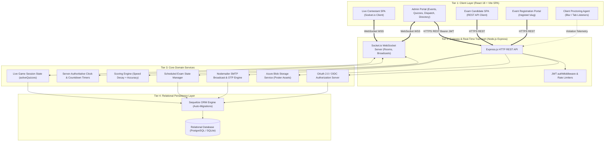
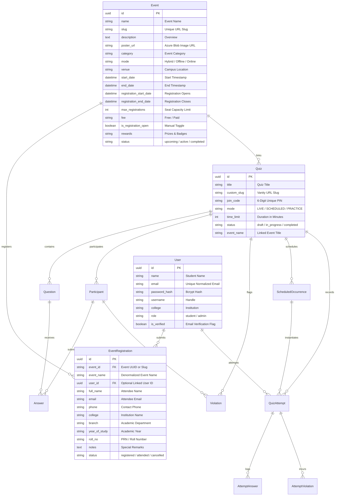

# System Architecture & Technical Design Document (Detailed Specification)

**Project Name**: Microsoft Student Club (MSC PRPCEM) — Real-Time Live & Scheduled Quiz Assessment Platform  
**System Version**: 2.2.0  
**Document Classification**: Engineering Architecture & Technical Design Specification  
**Primary Maintainer**: Microsoft Student Club Technical Architecture Team  
**Target Environments**: Node.js 18+ LTS, React 18+ (Vite), Sequelize ORM 6+, Socket.io 4+, Azure Blob Storage, SQLite 3 (Dev/Staging) & PostgreSQL 15+ (Production)

---

## Table of Contents
1. [Executive Summary & Core Architectural Tenets](#1-executive-summary--core-architectural-tenets)
2. [System Context & Domain Model](#2-system-context--domain-model)
3. [Codebase & Module Topology](#3-codebase--module-topology)
4. [High-Level Architecture & Multi-Tier Topology](#4-high-level-architecture--multi-tier-topology)
5. [Core Subsystems & Technical Workflow Specifications](#5-core-subsystems--technical-workflow-specifications)
   - 5.1 [Real-Time Socket.io Live Quiz Engine](#51-real-time-socketio-live-quiz-engine)
   - 5.2 [Scheduled Self-Paced Exam & Assessment Engine](#52-scheduled-self-paced-exam--assessment-engine)
   - 5.3 [Anti-Cheating, Proctoring & Violation Detection Subsystem](#53-anti-cheating-proctoring--violation-detection-subsystem)
   - 5.4 [Flagship Event Management & Dynamic Expiration Engine](#54-flagship-event-management--dynamic-expiration-engine)
   - 5.5 [Targeted Email Dispatch & Broadcast Subsystem](#55-targeted-email-dispatch--broadcast-subsystem)
   - 5.6 [Centralized SSO & OAuth 2.0 / OpenID Connect Provider](#56-centralized-sso--oauth-20--openid-connect-provider)
   - 5.7 [Question Bank & Scoring Analytics Subsystem](#57-question-bank--scoring-analytics-subsystem)
6. [Exhaustive Database Architecture & Data Dictionary](#6-exhaustive-database-architecture--data-dictionary)
   - 6.1 [Entity-Relationship Diagram (ERD)](#61-entity-relationship-diagram-erd)
   - 6.2 [Data Dictionary & Model Specifications](#62-data-dictionary--model-specifications)
7. [Comprehensive REST API & WebSocket Event Specification](#7-comprehensive-rest-api--websocket-event-specification)
   - 7.1 [RESTful API Endpoints](#71-restful-api-endpoints)
   - 7.2 [Socket.io Event Contracts (Client & Server)](#72-socketio-event-contracts-client--server)
8. [Client-Side UX & Performance Engineering](#8-client-side-ux--performance-engineering)
9. [Security Architecture & Threat Modeling](#9-security-architecture--threat-modeling)
10. [Reliability, Resilience & State Recovery](#10-reliability-resilience--state-recovery)
11. [Deployment, Infrastructure & Configuration Blueprint](#11-deployment-infrastructure--configuration-blueprint)

---

## 1. Executive Summary & Core Architectural Tenets

The **MSC PRPCEM Quiz & Assessment Platform** is an enterprise-grade testing and event operations ecosystem engineered to support:
1. **High-concurrency live multiplayer quiz competitions** with sub-50ms WebSocket latency.
2. **Formal scheduled proctored certifications** with automated timer evaluation and answer persistence.
3. **Flagship event registration management** with deadline countdowns, seat capacity constraints, and automatic lifecycle archival.
4. **Targeted email broadcasts** with dynamic placeholder merge tags and SMTP delivery.
5. **Centralized Single Sign-On (SSO / OIDC)** bridging student authentication across all MSC web properties.

```
┌─────────────────────────────────────────────────────────────────────────────────────────┐
│                              CORE ARCHITECTURAL TENETS                                  │
├────────────────────┬────────────────────┬───────────────────────┬───────────────────────┤
│ 1. Sub-50ms Sync   │ 2. Zero-Loss       │ 3. Automated          │ 4. Deterministic      │
│    Live State      │    Proctoring      │    Event Lifecycle    │    Scoring Engine     │
│ WebSocket rooms    │ Client blur, tab   │ Events automatically  │ Speed + accuracy      │
│ broadcast timers   │ switches, and      │ archive to completed  │ formula calculates    │
│ and answers with   │ fullscreen loss    │ when dates pass;      │ leaderboard rank      │
│ sub-50ms latency   │ logged in real-t   │ capacity locks seats  │ in real time          │
└────────────────────┴────────────────────┴───────────────────────┴───────────────────────┘
```

---

## 2. System Context & Domain Model

### 2.1. System Actors
1. **Contestant / Student**: Joins live quiz rooms via 6-digit PINs, registers for flagship technical events, participates in scheduled certification exams, tracks leaderboard rankings.
2. **Quiz Master / Admin**: Authors questions, controls live quiz question advancement, manages technical events and attendee rosters, broadcasts targeted emails, schedules exam time windows.
3. **Automated Proctor Agent**: Client-side monitoring hooks capturing tab switches, clipboard events, and window blur events.
4. **MSC Ecosystem Services**: External consumers of the platform's OpenID Connect SSO and public event feeds.

### 2.2. Operating Modes
- **Mode A: Real-Time Live Quiz (Host-Driven)**: Synchronized lobby via PIN code; admin triggers question transitions; scoring incorporates speed decay bonuses.
- **Mode B: Scheduled Self-Paced Exam (Candidate-Driven)**: Independent countdown timer within active window (`valid_from` to `valid_until`), randomized question order, answer persistence on selection.
- **Mode C: Public Event Registration Gateway**: Public landing pages (`/register/:slug`) with capacity caps, registration deadlines, and instant confirmation dispatch.

---

## 3. Codebase & Module Topology

```
Quiz-platform/
├── backend/
│   ├── src/
│   │   ├── config/
│   │   │   └── database.js            # Sequelize database connection & dialect config
│   │   ├── middleware/
│   │   │   └── auth.js                # Centralized JWT verification & session guards
│   │   ├── models/
│   │   │   ├── Admin.js               # Admin credentials & role flags
│   │   │   ├── Answer.js              # Live quiz participant answer submissions
│   │   │   ├── AttemptAnswer.js       # Scheduled quiz candidate answer selections
│   │   │   ├── AttemptViolation.js    # Scheduled quiz proctoring violation logs
│   │   │   ├── Event.js               # Flagship event metadata, dates, capacity & fees
│   │   │   ├── EventRegistration.js   # Student event registrations & participant PII
│   │   │   ├── Participant.js         # Live quiz participant records & scores
│   │   │   ├── Question.js            # Question bank (MCQ, Multi-select, Code, Media)
│   │   │   ├── Quiz.js                # Quiz parent metadata, mode, PIN, timer settings
│   │   │   ├── QuizAttempt.js         # Scheduled quiz attempt instance & final score
│   │   │   ├── ScheduledOccurrence.js # Time-window occurrence schedule
│   │   │   ├── User.js                # Synchronized student accounts & credentials
│   │   │   ├── Violation.js           # Live quiz proctoring violation events
│   │   │   └── index.js               # Model relationships & foreign key mappings
│   │   ├── routes/
│   │   │   ├── analytics.js           # Quiz metrics, question difficulty, export
│   │   │   ├── auth.js                # Admin authentication & token verification
│   │   │   ├── branding.js            # Custom themes, club logos, color tokens
│   │   │   ├── emailDispatch.js       # Targeted mass email broadcasting & templating
│   │   │   ├── eventsApi.js           # Event lifecycle, schedule dates & registration
│   │   │   ├── export.js              # CSV and Excel export generators
│   │   │   ├── quiz.js                # Synchronized Live Quiz operations
│   │   │   ├── scheduledQuiz.js       # Asynchronous Scheduled Quiz operations
│   │   │   ├── sso.js                 # OAuth 2.0 / OpenID Connect Identity Provider
│   │   │   ├── studentSync.js         # Student authentication, OTPs & certificates
│   │   │   └── userDirectory.js       # Paginated student directory & bulk actions
│   │   ├── services/
│   │   │   ├── azureBlobService.js    # Azure Blob Storage integration for poster uploads
│   │   │   ├── emailService.js        # Nodemailer SMTP transport & cryptographic OTPs
│   │   │   └── socket.js              # Socket.io real-time live game & timer engine
│   │   └── server.js                  # Express app, HTTP server, and Socket.io init
│   └── package.json
│
├── frontend/
│   ├── src/
│   │   ├── components/
│   │   │   ├── AdminLayout.jsx        # Unified administrative sidebar & topbar
│   │   │   ├── EventSelector.jsx      # Reusable event attachment dropdown
│   │   │   ├── Navbar.jsx             # Responsive mobile drawer & student chip
│   │   │   ├── Footer.jsx             # Legal links & 2-column mobile footer
│   │   │   └── Timer.jsx              # Circular SVG countdown timer
│   │   ├── context/
│   │   │   ├── AuthContext.jsx        # Centralized student & admin authentication
│   │   │   └── SocketContext.jsx      # Centralized Socket.io client instance
│   │   ├── pages/
│   │   │   ├── AdminDashboard.jsx     # Master admin control center
│   │   │   ├── AdminEmailDispatch.jsx # Mass email broadcaster interface
│   │   │   ├── AdminEvents.jsx        # Flagship event CRUD & attendee tables
│   │   │   ├── AdminScheduledQuizzes.jsx # Scheduled exams manager
│   │   │   ├── AdminUsers.jsx         # User directory & role oversight
│   │   │   ├── CreateScheduledQuiz.jsx# Scheduled quiz creation wizard
│   │   │   ├── EventRegister.jsx      # Public event registration page with timer
│   │   │   ├── Home.jsx               # Landing page with join code entry
│   │   │   ├── LiveQuiz.jsx           # Real-time contestant gameplay screen
│   │   │   ├── QuestionManagement.jsx # Question builder (Options, Points, Media)
│   │   │   ├── QuizManagement.jsx     # Live Quiz catalog & host controls
│   │   │   ├── Results.jsx            # Live podium & scorecard rankings
│   │   │   ├── RunQuiz.jsx            # Admin live host control dashboard
│   │   │   └── ScheduledQuizTake.jsx  # Candidate test-taking environment
│   │   ├── services/
│   │   │   └── api.js                 # Axios client with JWT interceptors
│   │   ├── App.jsx                    # Route switchboard & layout wrappers
│   │   └── index.css                  # Tailwind CSS, Fluent design tokens & responsive rules
│   └── package.json
│
├── report.md                          # Full security vulnerability audit & remediation scorecard
├── DESIGN.md                          # This architecture specification document
└── README.md                          # Project documentation & quickstart guide
```

---

## 4. High-Level Architecture & Multi-Tier Topology



---

## 5. Core Subsystems & Technical Workflow Specifications

### 5.1. Real-Time Socket.io Live Quiz Engine
- Synchronized lobby via PIN code.
- Admin triggers question transitions (`question_open`, `timer_tick`, `question_close`, `show_leaderboard`).
- Scoring incorporates time-decay bonuses: `Score = BasePoints * (TimeRemaining / TotalTime)`.

### 5.2. Scheduled Self-Paced Exam & Assessment Engine
- Candidate takes an individual attempt within an active time window (`valid_from` to `valid_until`).
- Independent countdown timer, randomized question order, answer persistence on every selection.
- Automatic submission upon timer expiry with proctoring violation summary.

### 5.3. Anti-Cheating, Proctoring & Violation Detection Subsystem
- Fullscreen lockdown, tab-switch listeners (`visibilitychange`), and window blur tracking.
- Configurable violation thresholds triggering automated disqualification or penalty deductions.

### 5.4. Flagship Event Management & Dynamic Expiration Engine
- Full event lifecycle management supporting start/end datetimes, registration deadlines, and seat capacity.
- Automatic status evaluation: if `new Date(event.end_date || event.start_date) < new Date()`, the event automatically moves to **Completed / Past Events** and closes registrations.
- Public registration endpoint (`POST /api/events/register`) automatically syncs attendees into matching live and scheduled quiz tracks.

### 5.5. Targeted Email Dispatch & Broadcast Subsystem
- Mass email delivery powered by Nodemailer SMTP transport.
- Dynamic placeholder replacement engine:
  - `{name}` → Recipient student name
  - `{college}` → Student institution
  - `{quiz_title}` → Associated challenge title
  - `{join_code}` → 6-character room PIN
  - `{score}` → Participant test score

### 5.6. Centralized SSO & OAuth 2.0 / OpenID Connect Provider
- Authorization code grant flow with cryptographic PKCE verification.
- Cookie-based session tracking and `/oauth/userinfo` OpenID profile endpoint.

---

## 6. Exhaustive Database Architecture & Data Dictionary

### 6.1. Entity-Relationship Diagram (ERD)



---

## 7. Comprehensive REST API & WebSocket Event Specification

### 7.1. RESTful API Endpoints Summary

| Group | Route | Method | Auth | Description |
| :--- | :--- | :---: | :---: | :--- |
| **Auth** | `/api/auth/login` | POST | Public (Rate Limited) | Admin login with JWT issue |
| **Auth** | `/api/auth/verify` | GET | Bearer JWT | Current admin session verification |
| **Live Quizzes** | `/api/quizzes` | GET | Bearer JWT | Live Quiz catalog (`mode=LIVE`) |
| **Live Quizzes** | `/api/quizzes` | POST | Bearer JWT | Create Live Quiz session |
| **Live Quizzes** | `/api/quizzes/public` | GET | Public | Public sanitized live quizzes |
| **Scheduled Quizzes**| `/api/scheduled-quizzes` | GET/POST | Bearer JWT | Scheduled quiz manager |
| **Scheduled Quizzes**| `/api/scheduled-quizzes/occurrences/:id` | GET | Public | Question sheet (answers stripped) |
| **Events** | `/api/events` | GET | Public | Flagship events catalog |
| **Events** | `/api/events` | POST | Bearer JWT | Create new technical event |
| **Events** | `/api/events/:id` | PUT/DELETE | Bearer JWT | Update/delete technical event |
| **Events** | `/api/events/:id/registrations` | GET | Bearer JWT | Attendee PII & contact list |
| **Events** | `/api/events/upload-poster` | POST | Bearer JWT | Upload image to Azure Blob Storage |
| **Events** | `/api/events/register` | POST | Public | Attendee event registration |
| **Email Dispatch** | `/api/admin/email-dispatch/send` | POST | Bearer JWT | Targeted broadcast dispatch |
| **User Directory** | `/api/admin/users` | GET | Bearer JWT | Paginated student user directory |
| **User Directory** | `/api/admin/users/:id` | DELETE | Bearer JWT | Single student deletion |
| **Analytics** | `/api/analytics/public/leaderboard` | GET | Public | Public top-10 leaderboard |
| **SSO** | `/oauth/userinfo` | GET | Bearer Token | OpenID Connect profile |

---

## 8. Client-Side UX & Performance Engineering

- **Mobile First Responsive Design**: Fluid typography (`clamp()`), safe-area padding for notches, and minimum 44px touch targets.
- **Top 3 Podium Architecture**: Responsive Gold (#1 on top), Silver (#2), and Bronze (#3) leaderboard layout.
- **Vite Bundle Optimization**: Vendor chunk splitting for React, Socket.io, Lucide icons, and QRCode generators.

---

## 9. Security Architecture & Threat Modeling

- **100% Remediated Scorecard**: All 19 audited vulnerabilities patched and verified.
- **Strict Authorization**: `authMiddleware` guards all admin-facing endpoints.
- **Sanitized Payloads**: Plaintext answers stripped from all public endpoints.
- **Brute-Force Throttling**: 10 requests per 15-minute window on auth and OTP routes.
- **Cryptographic Security**: Node.js `crypto` used for all OTPs and random join codes.

---

## 10. Reliability, Resilience & State Recovery

- **WebSocket Reconnection Protocol**: Automatic resume token allowing students to reconnect to live question rounds without losing score state.
- **Database Connection Pooling**: Tuned connection pool (`max: 40`) with automated SQLite/PostgreSQL schema migration.
