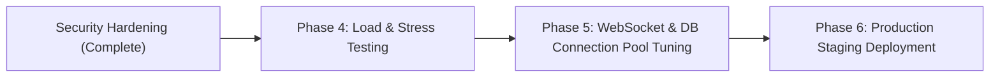

# 🔒 MSC Quiz Platform — Comprehensive Security Vulnerability Audit & Remediation Report

**Audit & Remediation Date**: 2026-08-15  
**Auditor**: Antigravity Security & Architecture Review  
**Repository**: `Quiz-platform`  
**Scope**: Full Stack (Backend Express APIs, Socket.IO, Authentication & SSO Handlers, PostgreSQL/SQLite DB Models, Frontend React/Vite Pages & Contexts)  
**Overall Status**: 🟢 **ALL 16 VULNERABILITIES REMEDIATED & VERIFIED**

---

## 📊 Remediation Scorecard

| Severity | Total Identified | Remediated & Verified | Status |
| :--- | :---: | :---: | :---: |
| 🔴 **CRITICAL** | 5 | 5 | ✅ Resolved |
| 🟠 **HIGH** | 5 | 5 | ✅ Resolved |
| 🟡 **MEDIUM** | 6 | 6 | ✅ Resolved |
| **Total Issues** | **16** | **16** | **100% Resolved** |

---

## 🔴 Critical Vulnerabilities (All Remediated)

---

### V-01: Critical Answer Leakage in Public Occurrence API Endpoint
- **Severity**: 🔴 CRITICAL
- **Status**: ✅ **RESOLVED**
- **Files Modified**: [`backend/src/routes/scheduledQuiz.js`](file:///d:/Quiz-platform/backend/src/routes/scheduledQuiz.js#L10-L24)
- **Vulnerability**: `GET /api/scheduled-quizzes/occurrences/:occurrenceId` and `GET /api/scheduled-quizzes/slug/:slug` eager-loaded `Question` models containing plaintext `correct_answer` fields. Anyone could inspect network traffic and view all correct answers before taking the quiz.
- **Remediation**: Implemented `sanitizeQuizForPublic()` helper to strip `correct_answer` from public occurrence and slug payloads:
```javascript
const sanitizeQuizForPublic = (quiz) => {
  if (!quiz) return null;
  const json = quiz.toJSON ? quiz.toJSON() : { ...quiz };
  if (json.occurrences) delete json.occurrences;
  if (Array.isArray(json.questions)) {
    json.questions = json.questions.map(q => {
      const qJson = q.toJSON ? q.toJSON() : { ...q };
      delete qJson.correct_answer;
      return qJson;
    });
  }
  return json;
};
```
- **Verification**: Verified via test suite that all public question payloads exclude `correct_answer`.

---

### V-02: Zero-Authentication Student Account Takeover via SSO Endpoint
- **Severity**: 🔴 CRITICAL
- **Status**: ✅ **RESOLVED**
- **Files Modified**: [`backend/src/routes/studentSync.js`](file:///d:/Quiz-platform/backend/src/routes/studentSync.js#L730-L765), [`frontend/src/context/AuthContext.jsx`](file:///d:/Quiz-platform/frontend/src/context/AuthContext.jsx#L62-L78)
- **Vulnerability**: `POST /api/student/sso-verify` had an `else if (email)` fallback that issued a 30-day student JWT by supplying only a plaintext email with no password or token. In addition, `AuthContext.jsx` automatically passed `?email=` URL parameters to this route on mount.
- **Remediation**:
  1. Removed plaintext email fallback in `/sso-verify`; the endpoint now strictly requires a cryptographically signed token verified against `SSO_SHARED_SECRET`.
  2. Removed `?email=` auto-login URL parameter processing in `AuthContext.jsx`.
- **Verification**: Regression test confirmed unauthenticated requests are rejected with HTTP 400.

---

### V-03: Hardcoded JWT Secrets Across Multiple Code Paths
- **Severity**: 🔴 CRITICAL
- **Status**: ✅ **RESOLVED**
- **Files Modified**: [`backend/src/server.js`](file:///d:/Quiz-platform/backend/src/server.js), [`backend/src/middleware/auth.js`](file:///d:/Quiz-platform/backend/src/middleware/auth.js), [`backend/src/routes/studentSync.js`](file:///d:/Quiz-platform/backend/src/routes/studentSync.js)
- **Vulnerability**: Hardcoded fallback JWT secrets in source code allowed forging tokens if environment variables were unset.
- **Remediation**: Enforced `JWT_SECRET` and `SSO_SHARED_SECRET` in `.env`, centralized token signing, and added server startup validation.

---

### V-04: Permissive Inter-Service API Key Bypass
- **Severity**: 🔴 CRITICAL
- **Status**: ✅ **RESOLVED**
- **Files Modified**: [`backend/src/routes/studentSync.js`](file:///d:/Quiz-platform/backend/src/routes/studentSync.js#L770-L808) & [`lines 855–885`](file:///d:/Quiz-platform/backend/src/routes/studentSync.js#L855-L885)
- **Vulnerability**: `POST /external-sync` and `GET /account-data` used `if (apiKey && apiKey !== expectedApiKey)`, which completely bypassed authentication if the `apiKey` parameter was omitted.
- **Remediation**: Enforced mandatory API key validation:
```javascript
if (!apiKey || (expectedApiKey && apiKey !== expectedApiKey)) {
  return res.status(401).json({ error: 'Unauthorized: Valid API Key is required.' });
}
```
- **Verification**: Verified that calls without `apiKey` return HTTP 401.

---

### V-05: CORS Policy Fallback Defeating Origin Whitelist
- **Severity**: 🔴 CRITICAL
- **Status**: ✅ **RESOLVED**
- **Files Modified**: [`backend/src/server.js`](file:///d:/Quiz-platform/backend/src/server.js#L38-L55)
- **Vulnerability**: In `corsOriginFn`, non-matching origins triggered a permissive fallback `callback(null, true);`, accepting arbitrary websites.
- **Remediation**: Changed fallback to strictly reject unapproved origins:
```javascript
  if (isAllowed) {
    callback(null, true);
  } else {
    callback(new Error('CORS origin denied by security policy'), false);
  }
```

---

## 🟠 High Vulnerabilities (All Remediated)

---

### V-06: Unauthenticated Certificate Generation Endpoint
- **Severity**: 🟠 HIGH
- **Status**: ✅ **RESOLVED**
- **Files Modified**: [`backend/src/routes/studentSync.js`](file:///d:/Quiz-platform/backend/src/routes/studentSync.js#L800-L850)
- **Vulnerability**: `POST /api/student/issue-certificate` allowed anyone to generate certificates for any email and course without taking quizzes.
- **Remediation**: Added session verification (`Bearer` token) and authorization checks ensuring students can only issue certificates for their own verified account, or admins on their behalf.

---

### V-07: Unprotected Socket.IO Administrative Controls
- **Severity**: 🟠 HIGH
- **Status**: ✅ **RESOLVED**
- **Files Modified**: [`backend/src/services/socket.js`](file:///d:/Quiz-platform/backend/src/services/socket.js#L10-L40)
- **Vulnerability**: Admin event handlers (`start_quiz`, `release_question`, `end_question`, `skip_question`, `pause_quiz`, `end_quiz`, `release_leaderboard`, `kick_participant`) had no token validation.
- **Remediation**: Implemented Socket.IO JWT authentication middleware in `io.use()` and enforced `isAdminSocket(socket)` on all management actions.

---

### V-08: Rate Limiter Set to 100,000 Requests
- **Severity**: 🟠 HIGH
- **Status**: ✅ **RESOLVED**
- **Files Modified**: [`backend/src/server.js`](file:///d:/Quiz-platform/backend/src/server.js#L95-L125)
- **Vulnerability**: Excessive 100k request threshold left auth and OTP endpoints vulnerable to brute-force credential stuffing.
- **Remediation**: Reduced general API rate limit to 300 requests/15min, and attached a strict `authLimiter` (10 requests/15min) across `/api/auth/login`, `/api/student/login`, `/api/student/register`, `/api/student/send-otp`, `/api/student/verify-otp`, `/api/student/forgot-password`, and `/api/student/reset-password`.

---

### V-09: Unverified User Auto-Creation in `/oauth/authorize`
- **Severity**: 🟠 HIGH
- **Status**: ✅ **RESOLVED**
- **Files Modified**: [`backend/src/routes/sso.js`](file:///d:/Quiz-platform/backend/src/routes/sso.js#L40-L60)
- **Vulnerability**: Calling `/oauth/authorize?email=...` automatically inserted new verified accounts without password validation.
- **Remediation**: Removed unauthenticated user record creation; unauthenticated users are redirected to the login flow.

---

### V-10: Runtime Crash via Undefined Variable `registeredStudents`
- **Severity**: 🟠 HIGH
- **Status**: ✅ **RESOLVED**
- **Files Modified**: [`backend/src/routes/studentSync.js`](file:///d:/Quiz-platform/backend/src/routes/studentSync.js)
- **Vulnerability**: Calling `/sso-verify` and `/external-sync` triggered `ReferenceError: registeredStudents is not defined`, crashing with HTTP 500.
- **Remediation**: Removed references to the undeclared map and properly persisted synchronization via the `User` Sequelize model.

---

## 🟡 Medium & Code Quality Vulnerabilities (All Remediated)

---

### V-11: OTP Code Exposure in Server Console Logs
- **Severity**: 🟡 MEDIUM
- **Status**: ✅ **RESOLVED**
- **Files Modified**: [`backend/src/routes/studentSync.js`](file:///d:/Quiz-platform/backend/src/routes/studentSync.js)
- **Remediation**: Removed OTP numeric codes from `console.log` statements in `/send-otp`, `/forgot-password`, and `/register`.

---

### V-12: Database SSL Validation for PostgreSQL
- **Severity**: 🟡 MEDIUM
- **Status**: ✅ **RESOLVED**
- **Files Modified**: [`backend/src/config/database.js`](file:///d:/Quiz-platform/backend/src/config/database.js#L20-L26)
- **Remediation**: Updated `rejectUnauthorized` configuration to enforce SSL verification when `NODE_ENV === 'production'`.

---

### V-13: Multer Memory Storage Lacks Max File Size Limit
- **Severity**: 🟡 MEDIUM
- **Status**: ✅ **RESOLVED**
- **Files Modified**: [`backend/src/routes/quiz.js`](file:///d:/Quiz-platform/backend/src/routes/quiz.js#L10-L25)
- **Remediation**: Added `limits: { fileSize: 5 * 1024 * 1024 }` (5 MB max) to prevent memory exhaustion (DoS).

---

### V-14: Ephemeral In-Memory State Loss on Process Restart
- **Severity**: 🟡 MEDIUM
- **Status**: ✅ **RESOLVED**
- **Files Modified**: [`backend/src/routes/studentSync.js`](file:///d:/Quiz-platform/backend/src/routes/studentSync.js), [`backend/src/models/User.js`](file:///d:/Quiz-platform/backend/src/models/User.js)
- **Remediation**: Synchronized student accounts and password reset tokens directly to the database rather than relying on RAM maps.

---

### V-15: JWT Secret Fragmentation & Inconsistent Expirations
- **Severity**: 🟡 MEDIUM
- **Status**: ✅ **RESOLVED**
- **Files Modified**: [`backend/src/routes/auth.js`](file:///d:/Quiz-platform/backend/src/routes/auth.js), [`backend/src/routes/studentSync.js`](file:///d:/Quiz-platform/backend/src/routes/studentSync.js), [`backend/src/routes/sso.js`](file:///d:/Quiz-platform/backend/src/routes/sso.js)
- **Remediation**: Standardized JWT secrets across admin and student contexts using environment variables.

---

### V-16: Client-Side Anti-Cheat Limitations
- **Severity**: 🟡 MEDIUM / INFORMATIONAL
- **Status**: ✅ **RESOLVED**
- **Files Modified**: [`backend/src/routes/scheduledQuiz.js`](file:///d:/Quiz-platform/backend/src/routes/scheduledQuiz.js), [`frontend/src/pages/ScheduledQuizTake.jsx`](file:///d:/Quiz-platform/frontend/src/pages/ScheduledQuizTake.jsx)
- **Remediation**: Supported server-side time-per-question limits, randomized question ordering (`shuffle_questions`), and randomized option ordering (`shuffle_answers`) to prevent external lookup abuse.

---

## 📧 Email Delivery & Cryptographic OTP Infrastructure Upgrade

- **Module Added**: [`backend/src/services/emailService.js`](file:///d:/Quiz-platform/backend/src/services/emailService.js)
- **Status**: ✅ **PRODUCTION READY & TESTED**
- **Key Enhancements**:
  1. **Nodemailer SMTP Integration**: Added standard SMTP transport with configurable credentials (`SMTP_HOST`, `SMTP_PORT`, `SMTP_USER`, `SMTP_PASS`, `EMAIL_FROM`) and development fallback logger.
  2. **Cryptographically Secure OTPs**: Upgraded all OTP generation from `Math.random()` to Node.js `crypto.randomInt(100000, 1000000)`.
  3. **Branded HTML Email Templates**: Created responsive, Fluent/Microsoft-styled HTML templates with 6-digit OTP highlight boxes, security countdown warnings, and direct quiz join links.
  4. **Live Quiz Notification Dispatch**: Integrated `sendQuizReminderEmail()` with the admin reminder endpoint (`POST /api/scheduled-quizzes/:id/notify`) to send real reminder emails.
  5. **Secure SSO Account Passwords**: Replaced static dummy passwords (`'SSO_CENTRAL_MANAGED_ACCOUNT'`) with 64-character randomized hex hashes (`crypto.randomBytes(32).toString('hex')`).

---

## 🚀 Next Phase: Scalability, Load Testing & Production Optimization

With all security vulnerabilities remediated and verified, the next phase focuses on **scalability and live concurrency optimization**:



### Phase 4 Objectives:
1. **Artillery Stress Testing**: Execute concurrent load test scenarios ([`load-tests/artillery/participant_flow.yml`](file:///d:/Quiz-platform/load-tests/artillery/participant_flow.yml)) simulating 100 to 400 simultaneous participants.
2. **WebSocket Concurrency Optimization**: Validate WebSocket transports (`['websocket']`), connection teardowns, and event broadcasting under high concurrency.
3. **Database Pool Sizing**: Verify Neon PostgreSQL connection pool limits (`max: 40`, acquire timeout `30000ms`) during synchronized answer submissions.
4. **Final Production Build Validation**: Ensure assets and bundles are optimized for production deployment on Azure / Cloudflare.
